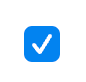
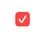

CheckBox를 위한 DDS Docs입니다. CheckBox Docs는 '도담도담'에 사용되는 모든 CheckBox Component를 관리합니다. CheckBox는 `<DodamCheckBox />`를 사용해서 불러올 수 있습니다.

## Props

```plain
- color?: ButtonColor;
- isDiabled: boolean;
- onClick: MouseEventHandler<HTMLDivElement>
- customStyle?: CSSObject
```

## Disabled

import { DodamCheckBox } from '@b1nd/dds-web'

import CheckBox from "./CheckBox"

<DodamCheckBox isDisabled={true} />

```tsx title="index.tsx"
<DodamCheckBox isDisabled={true} />
```

## Checked



```tsx title="index.tsx"
<DodamCheckBox />
```

## Error



```tsx title="index.tsx"
<DodamCheckBox color='red' />
```
