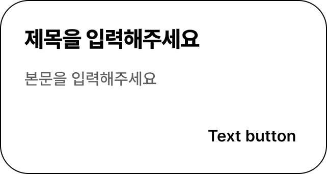

DoddamDialog를 위한 DDS Docs입니다. DoddamDialog Docs는 '도담도담'에 사용되늰 모든 DoddamDialog Component를 관리힙니다. DoddamDialog는 `DodamDialog.confirm` 또는 `DodamDialog.alert`을 사용해서 볼러올 수 있습니다.

## Props

```plain
- title: string
- text: string
- type: DialogType (AlertProps | ConfirmProps)
- color? : {
    dialogBackgroundColor?: CSSProperties["backgroundColor"]
    titleColor?: CSSProperties["color"]
    textColor?: CSSProperties["color"]
  }
- radius?: ShapeSizeType ("ExtraSmall" | "Small" | "Medium" | "Large" | "ExtraLarge")

* AlertProps *
- dialog: "ALERT"
- close: DialogHandlerType;

* ConfirmProps *
- dialog: "CONFIRM"
- confirm: DialogHandlerType
- dismiss: DialogHandlerType
```

## ALERT Dialog

실제 ALERT Dialog에서는 border가 들어가있지않은 상태로 나타납니다.

import { DodamDialog } from '@b1nd/dds-web'



```ts title="useHook.ts"
const alert = DodamDialog.alert(message, title)
```
