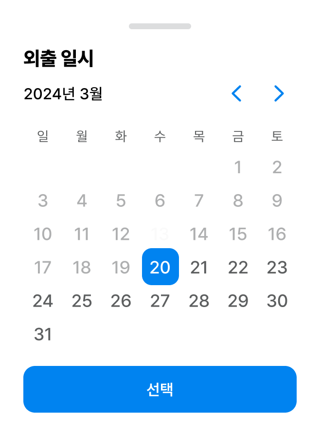
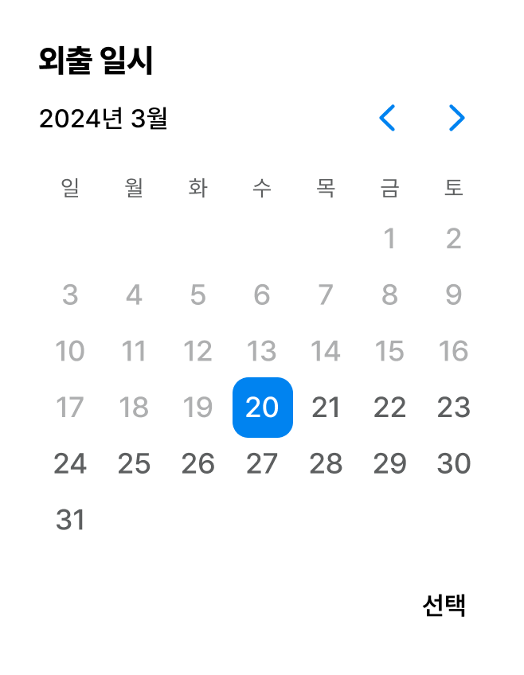

DatePicker를 위한 DDS Docs입니다. DatePicker Docs는 '도담도담'에 사용되는 모든 DatePicker Component를 관리합니다. DatePicker는 `<DodamDatePicker />`를 사용해서 불러올 수 있습니다.

## Props

```plain
- itemKey: string
- width?:  number
- height?: number
- customStyle?: CSSObject
- onChange: (e: Date) => void
- value: string
- children?: JSX.Element | string
- title : string
- typography?: typographyType (['Body1', 'Bold'])
- type?:DatePickerMode ('entire' | 'future')
- iconSize?:number
- color?:keyof DodamTheme | string (labelAlternative, labelAssistive ...)
```

## EntireDatePicker



```tsx title="index.tsx"
<DodamDatePicker
  color=''
  height={40}
  itemKey='entire'
  onChange={() => {}}
  title='외출 일시'
  type='entire'
  value='2024-11-12'
  width={100}
/>
```

## FutureDatePicker



```tsx title="index.tsx"
<DodamDatePicker
  color=''
  height={40}
  itemKey='future'
  onChange={() => {}}
  title='외출 일시'
  type='future'
  value='2024-11-12'
  width={100}
/>
```
