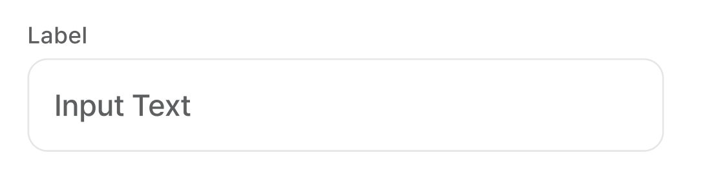
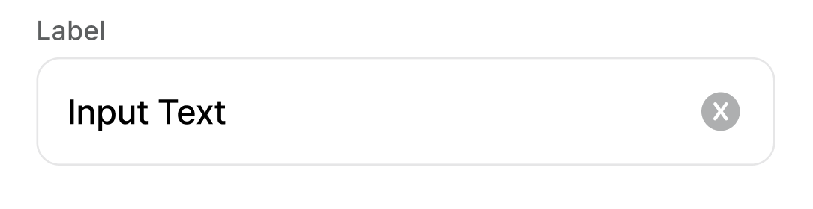
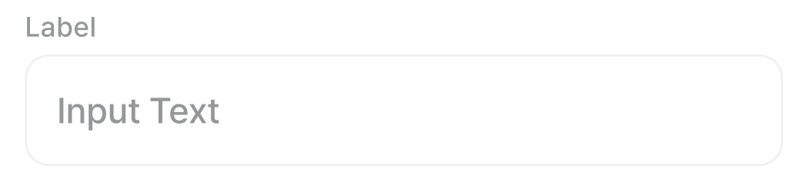
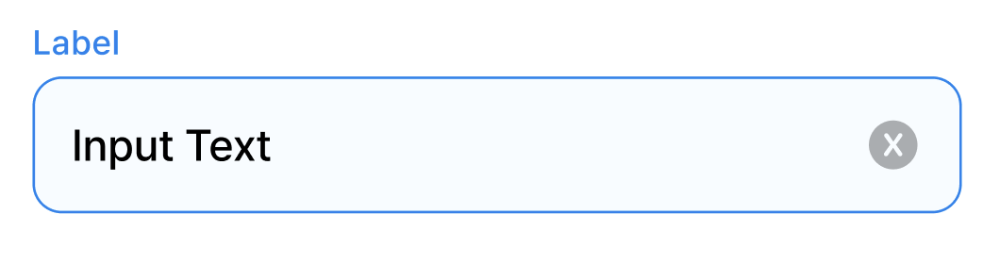
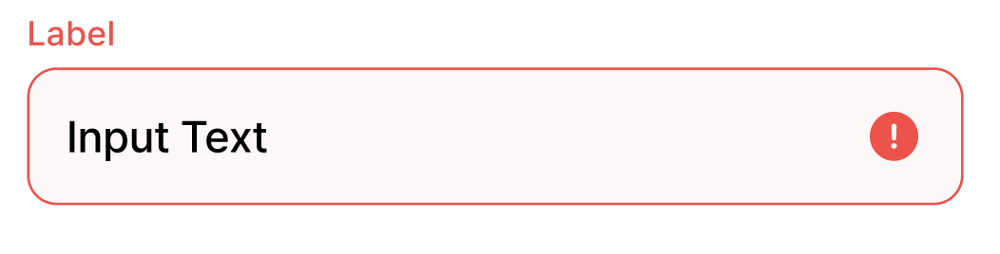

DodamFilledTextField 위한 DDS Docs입니다. DodamFilledTextField Docs는 '도담도담'에 사용되는 모든 DodamFilledTextField Component를 관리합니다. DodamFilledTextField는 `<DodamFilledTextField />`를 사용해서 불러올 수 있습니다.

## Props

```plain
- type: InputType (text | password)
- label: string
- isError?: boolean
- width?: number
- value: string
- placeholder: string
- isDisabled?: boolean
- supportingText?: string
- showIcon?: boolean
- customStyle?: CSSObject
- onChange: ChangeEventHandler<HTMLInputElement>
- onKeyDown?: KeyboardEventHandler<HTMLInputElement>
- onRemoveClick?: () => void
```

## default



```tsx title="index.tsx"
<DodamFilledTextField
  type='text'
  label='label'
  value=''
  placeholder='Input Text'
  onChange={{}}
/>
```

## unfocused



```tsx title="index.tsx"
<DodamFilledTextField
  type='text'
  label='label'
  value='Input Text'
  placeholder='Input Text'
  onChange={{}}
/>
```

## disabled



```tsx title="index.tsx"
<DodamFilledTextField
  type='text'
  label='label'
  value='Input Text'
  placeholder='Input Text'
  isDisabled={true}
  onChange={{}}
/>
```

## focused



```tsx title="index.tsx"
<DodamFilledTextField
  type='text'
  label='label'
  value='Input Text'
  placeholder='Input Text'
  onChange={{}}
/>
```

## error



```tsx title="index.tsx"
<DodamFilledTextField
  type='text'
  label='label'
  value='Input Text'
  placeholder='Input Text'
  isError={true}
  onChange={{}}
/>
```