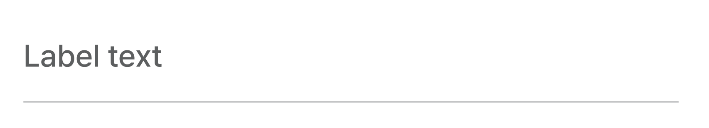
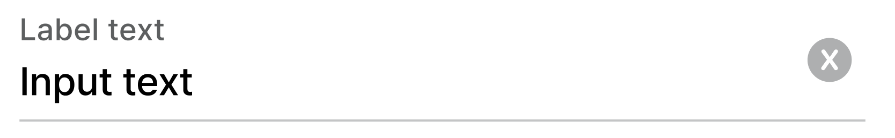
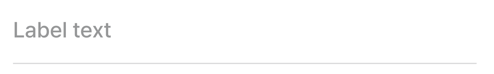
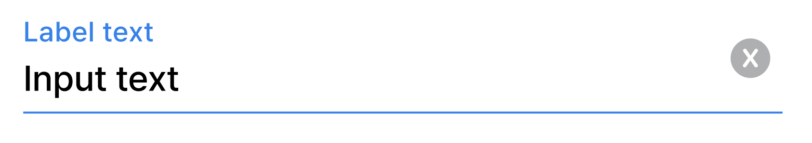
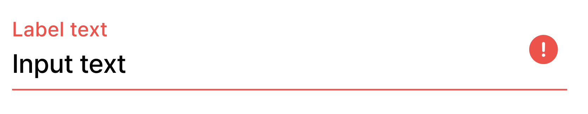

DodamFilledTextField 위한 DDS Docs입니다. DodamFilledTextField Docs는 '도담도담'에 사용되는 모든 DodamFilledTextField Component를 관리합니다. DodamFilledTextField는 `<DodamFilledTextField />`를 사용해서 불러올 수 있습니다.

## Props

```plain
- id: string
- name: string
- type: InputType (text | password)
- value: string
= label: string
- isError?: boolean
- showIcon?: boolean
- onChange: ChangeEventHandler<HTMLInputElement>
- onKeyDown?: KeyboardEventHandler<HTMLInputElement>
- isDisabled?: boolean
- width?: number
- labelStyle?: CSSProperties
- supportingText?: string
- customStyle?: CSSObject
- onRemoveClick?: ()=>void
```

## default



```tsx title="index.tsx"
<DodamTextField
  id='id'
  name='name'
  type='text'
  label='Label text'
  value=''
  onChange={{}}
/>
```

## unfocused



```tsx title="index.tsx"
<DodamTextField
  id='id'
  name='name'
  type='text'
  label='Label text'
  value='Input text'
  onChange={{}}
/>
```

## disabled



```tsx title="index.tsx"
<DodamTextField
  id='id'
  name='name'
  type='text'
  label='Label text'
  value=''
  isDisabled={true}
  onChange={{}}
/>
```

## focused



```tsx title="index.tsx"
<DodamTextField
  id='id'
  name='name'
  type='text'
  label='Label text'
  value='Input text'
  onChange={{}}
/>
```

## error



```tsx title="index.tsx"
<DodamTextField
  id='id'
  name='name'
  type='text'
  label='Label text'
  value='Input text'
  isError={true}
  onChange={{}}
/>
```
